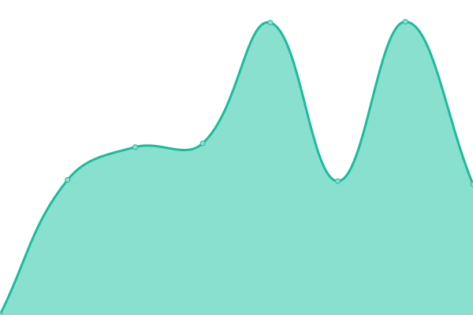

# [📈 Live Status](https://https://pokemopsi.github.io/upptime-upptime/): <!--live status--> **🟩 All systems operational**

This repository contains the open-source uptime monitor and status page for [Pokemopsi](https://https://pokemopsi.github.io/upptime-upptime/), powered by [Upptime](https://github.com/upptime/upptime).

With [Upptime](https://upptime.js.org), you can get your own unlimited and free uptime monitor and status page, powered entirely by a GitHub repository. We use [Issues](https://github.com/Pokemopsi/upptime/issues) as incident reports, [Actions](https://github.com/Pokemopsi/upptime/actions) as uptime monitors, and [Pages](https://https://pokemopsi.github.io/upptime-upptime/) for the status page.

<!--start: status pages-->
<!-- This summary is generated by Upptime (https://github.com/upptime/upptime) -->
<!-- Do not edit this manually, your changes will be overwritten -->
<!-- prettier-ignore -->
| URL | Status | History | Response Time | Uptime |
| --- | ------ | ------- | ------------- | ------ |
|  [Sogo](https://sogo.uni-osnabrueck.de) | 🟩 Up | [sogo.yml](https://github.com/Pokemopsi/upptime-upptime/commits/HEAD/history/sogo.yml) | 

 680ms
     
 | 

<a href="https://https://pokemopsi.github.io/upptime-upptime//history/sogo">100.00%</a>
    

|  [Rechenzentrum Uni](https://www.rz.uni-osnabrueck.de) | 🟩 Up | [rechenzentrum-uni.yml](https://github.com/Pokemopsi/upptime-upptime/commits/HEAD/history/rechenzentrum-uni.yml) | 

 1203ms
     
 | 

<a href="https://https://pokemopsi.github.io/upptime-upptime//history/rechenzentrum-uni">100.00%</a>
    

|  [Stud.IP](https://studip.uni-osnabrueck.de) | 🟩 Up | [stud-ip.yml](https://github.com/Pokemopsi/upptime-upptime/commits/HEAD/history/stud-ip.yml) | 

 1076ms
     
 | 

<a href="https://https://pokemopsi.github.io/upptime-upptime//history/stud-ip">100.00%</a>
    

|  [Uni Bibliothek](https://www.ub.uni-osnabrueck.de) | 🟩 Up | [uni-bibliothek.yml](https://github.com/Pokemopsi/upptime-upptime/commits/HEAD/history/uni-bibliothek.yml) | 

 1266ms
     
 | 

<a href="https://https://pokemopsi.github.io/upptime-upptime//history/uni-bibliothek">100.00%</a>
    

<!--end: status pages-->

[**Visit our status website →**](https://https://pokemopsi.github.io/upptime-upptime/)

## 📄 License

- Powered by: [Upptime](https://github.com/upptime/upptime)
- Code: [MIT](./LICENSE) © [Pokemopsi](https://https://pokemopsi.github.io/upptime-upptime/)
- Data in the `./history` directory: [Open Database License](https://opendatacommons.org/licenses/odbl/1-0/)
